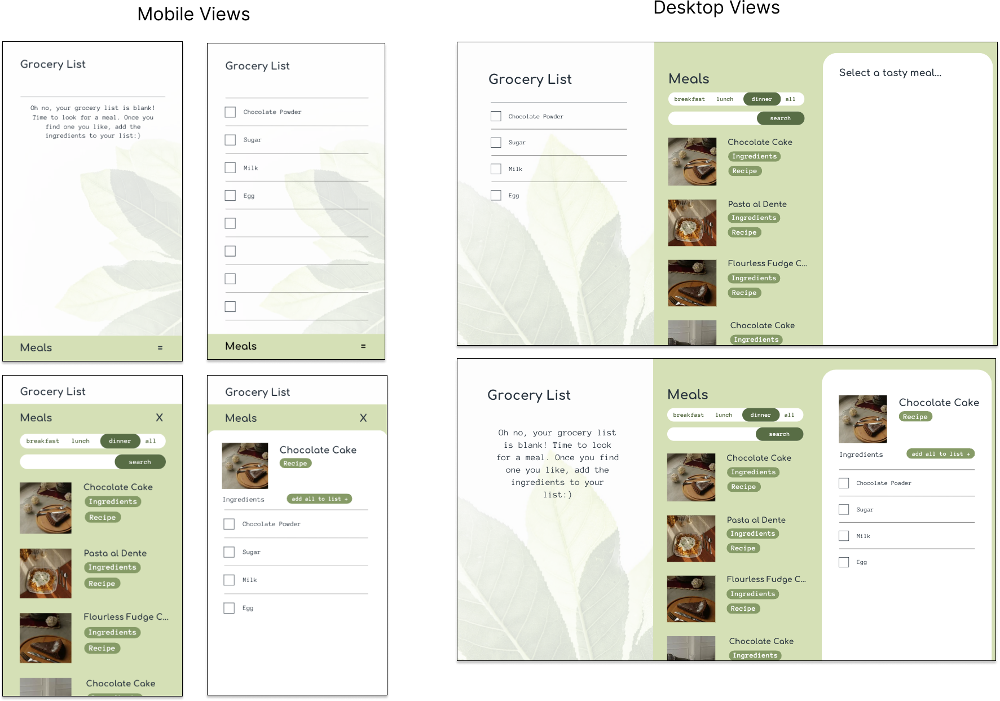

# React Project

[Meal Prep](https://mickrueg-meal-prep.netlify.app/)

## Description

This mobile and desktop friendly web application helps procrastinators with quickly creating a grocery list. Backed by thousands of real recipes, this app simply consolidates the ingredients needed for all intended recipes. 

## Design & Wireframes

The app consists of three main components. A main component that keeps the selected recipes and ingredients in order; the search component that allows the user to search for a recipe; and the information component that lists the selected recipe's ingredients. 
 
 

### (1) Main Component

 

### (2) Search Component

 

### (3) Information Component

  

## Planning

The original design was created in Canva and collected together in Figma. Here was the original wireframe.
 
 

### Wireframe

 

## Technologies Used

### React, JavaScript, CSS
This application was built with React JS. Nine components were created in this app. In order to track selected recipes, the UseState and UseContext are relied on.

### Export
Because the user's activities are erased every time the app reloads, I installed an "save to clipboard" function. This allows the user to easily copy/paste the recipes and ingredients to their notes for future reference.

### API Fetch
API calls are being made to [Edamam](https://www.edamam.com/). The call returns links to recipes, ingredients, and images.

 

## Getting Started/Installation Instructions

To run the application, click the [live link here](https://mickrueg-meal-prep.netlify.app/).

 

## Contribution Guidelines

You may fork/clone this repository to run the code. You may contribute to the code by sending a push request to this repository.